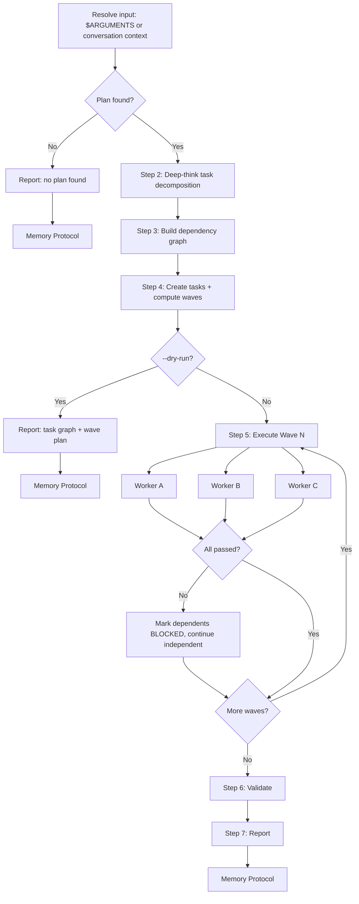

# Delegate

Parallel execution coordinator. Read a plan or conversation context, decompose it into
a dependency-ordered task graph, and spawn worker sub-agents in parallel waves. Each wave
completes before the next begins. Results are collected, validated, and reported.

**Core principle: maximize parallelism while respecting dependencies absolutely.**

## Decision Flow



## Instructions

### 1. Resolve input

Arguments received: `$ARGUMENTS`

- If `--plan <path>` is provided, read that file
- If no arguments, use the current conversation context (the plan should be visible
  from a prior `/prd`, plan discussion, or issue triage output)
- If `--dry-run` is present, set DRY_RUN=true

If no plan is found in either source, report:
> No plan found. Provide a plan file path with `--plan <path>` or discuss the plan first, then run `/delegate`.

Run Memory Protocol and stop.

### 2. Decompose into tasks (use extended thinking)

Analyze the plan deeply and produce a structured task list. For each task, determine:

| Field | Description |
|-------|-------------|
| **ID** | Sequential: T1, T2, T3, ... |
| **Title** | Short imperative description |
| **Description** | What the worker agent needs to do (2-3 sentences, include file paths) |
| **Depends On** | Task IDs this requires first, or "none" |
| **Files** | Key files the worker will read or modify |
| **Model** | haiku (config/docs) / sonnet (standard) / opus (complex architecture) |
| **Acceptance** | How to verify the task is done (objectively checkable) |

**Decomposition rules:**
- Each task must be completable by a single sub-agent in one session
- Prefer more smaller tasks over fewer larger ones
- Schema/infrastructure before backend, backend before frontend
- Tasks that touch different files with no shared state CAN be parallel
- Tasks that modify the same file or depend on another's output MUST be sequential
- Every task must have at least one verifiable acceptance criterion

### 3. Build dependency graph and compute waves

Arrange tasks into parallel execution waves using topological ordering:

1. **Wave 1**: All tasks with `Depends On: none` -- run first, in parallel
2. **Wave 2**: All tasks whose dependencies are entirely within Wave 1
3. **Wave N**: All tasks whose dependencies are entirely within Waves 1..N-1

Output the wave plan:

| Wave | Tasks | Parallelism | Complexity |
|------|-------|-------------|------------|
| 1 | T1, T2, T3 | 3 agents | S + S + M |
| 2 | T4, T5 | 2 agents | M + S |
| 3 | T6 | 1 agent | L |

**Validation:**
- No circular dependencies (if found, report error and stop)
- Max 5 concurrent agents per wave (split larger waves into sub-waves)

### 4. Create tasks and track dependencies

Use `TaskCreate` for each task. Then use `TaskUpdate` with `addBlockedBy` to wire dependencies.

If `--dry-run`, output the full task graph and wave plan, then skip to **Step 8**.

### 5. Execute waves

For each wave, starting from Wave 1:

**a) Spawn worker agents in ONE message (parallel)**

Launch N `Agent` tool calls **in a single message** for parallel execution. Each worker receives:
- Task ID, title, description, files, and acceptance criteria
- Summaries of completed prior-wave results (not full output)
- Instruction: report what was done, what files changed, whether acceptance criteria are met

Worker configuration:
- **Model**: as specified in the task decomposition (haiku/sonnet/opus)
- **run_in_background**: true (for waves with 2+ tasks)

**b) Collect results**

After all agents in the wave complete, update each task via `TaskUpdate`:

| Task | Status | Summary | Files Changed |
|------|--------|---------|---------------|
| T1 | completed | Created schema migration | prisma/schema.prisma |
| T2 | completed | Added API route | src/app/api/... |
| T3 | FAIL | Type error in ... | -- |

**c) Handle failures**

If any task fails:
- Log the failure with details
- Check if tasks in subsequent waves depend on the failed task
- Mark dependent tasks as BLOCKED (do not execute them)
- Continue with non-dependent tasks in the next wave

**d) Advance to next wave**

Pass completed task summaries as context to the next wave's workers. Repeat until all waves complete or all remaining tasks are blocked.

### 6. Validate

After all waves complete:

1. Review acceptance criteria for every completed task
2. If the plan involved code changes, run verification:

```bash
cd ~/harness/workspace/projects/next-app && npm run type-check 2>&1 || true
cd ~/harness/workspace/projects/next-app && npm run lint 2>&1 || true
cd ~/harness/workspace/projects/next-app && npm test 2>&1 || true
```

3. If validation fails, note which tasks likely caused the failure

### 7. Report

Output a structured summary:

```
## Delegation Report

### Task Summary
| Task | Wave | Status | Summary |
|------|------|--------|---------|
| T1   | 1    | DONE   | ...     |
| T2   | 1    | DONE   | ...     |
| T3   | 1    | FAIL   | ...     |
| T4   | 2    | BLOCKED| Depends on T3 |

### Execution Stats
- Total tasks: N
- Completed: N
- Failed: N
- Blocked: N
- Waves executed: N
- Max parallelism: N agents

### Validation
- Type check: PASS/FAIL
- Lint: PASS/FAIL
- Tests: PASS/FAIL

### Issues Requiring Attention
- [list any failures, blocked tasks, or validation errors]
```

### 8. Memory Improvement Protocol

Run at the end of **every** execution -- op, dry-run, or error.

**a) Log** -- append to `memory/YYYY-MM-DD.md`:

```markdown
## Delegate -- HH:MM UTC
- **Result**: OP | DRY-RUN | PARTIAL | FAIL
- **Plan**: "<plan title or source>"
- **Action**: [N tasks across M waves, P parallel max; X completed, Y failed, Z blocked]
- **Duration**: ~Xs
- **Observation**: [one sentence]
```

**b) Qualify** -- ask:
- Did dependency analysis reveal unexpected coupling?
- Did a worker fail on a task that seemed straightforward?
- Was parallelism limited by dependencies more than expected?

**c) Improve** -- if actionable, append to `MEMORY.md > Lessons Learned`

## Reference

### Wave Execution Rules

| Rule | Value |
|------|-------|
| Max concurrent agents per wave | 5 (split larger waves) |
| Failure handling | Mark dependent tasks BLOCKED, continue independent ones |
| Context passing | Prior wave summaries, not full output |
| Model selection | haiku: config/docs, sonnet: standard, opus: complex |

### Key Resources

| Resource | Path |
|----------|------|
| Agent: Implementer | `.claude/agents/implementer.md` |
| Agent: Critic | `.claude/agents/critic.md` |
| Agent: PM | `.claude/agents/pm.md` |
| Agent: Council | `.claude/agents/council.md` |
| Identity | `IDENTITY.md` |
| Memory | `MEMORY.md` |
| Daily Logs | `memory/YYYY-MM-DD.md` |
