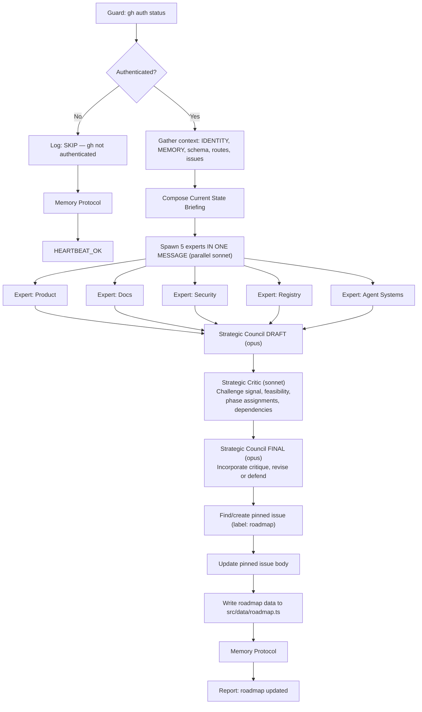

# Strategic Proposal

Spawn 5 specialized expert sub-agents in parallel, each proposing roadmap items from their domain. An Expert AI Council drafts the roadmap, a Strategic Critic challenges it with adversarial backpressure, and the Council finalizes with revisions. The result is published as a pinned GitHub issue and written to `src/data/roadmap.ts`.

**Core principle: SIGNAL OVER FEATURES.** Items require evidence of user demand before entering "Build Now" phase. Infrastructure prerequisites are exempt. The Critic ensures the council isn't inflating signal or sandbagging complexity.

## Decision Flow



## Instructions

### 1. Guard: gh CLI authentication

```bash
gh auth status 2>&1
```

If this fails, log `[strategic-proposal] SKIP: gh CLI not authenticated` → Memory Protocol → `HEARTBEAT_OK`. Stop.

### 2. Gather context

Read the following to build the briefing:
- `IDENTITY.md` — stack, mission, URLs
- `MEMORY.md` — past decisions, lessons learned
- `next-app/prisma/schema.prisma` — current data models
- `next-app/src/app/` — list current routes
- Open issues: `gh api "repos/ryaneggz/next-postgres-shadcn/issues?state=open&per_page=50"`
- Repo stats: `gh api repos/ryaneggz/open-harness --jq '{stars: .stargazers_count, forks: .forks_count}'`

### 3. Compose the Current State Briefing

Assemble a structured markdown briefing to pass to ALL 5 experts:

```markdown
## Current State Briefing

### Product Vision
1. Document Open Harness — the parent framework for AI agent sandboxes
2. Let users promote their forks — fork registry/showcase
3. End goal: curate Docker registries with monthly licensing — SaaS marketplace

### App State
- Routes: [list from step 2]
- Prisma models: [list or "none"]
- Auth: none
- API routes: none

### Infrastructure
- Docker Compose + PostgreSQL 16 + cloudflared tunnel
- CI/CD: GitHub Actions (lint, format, type-check, build, test, E2E)
- Release: CalVer → GHCR Docker image
- Agent: 8 skills, 7 sub-agents, 4 heartbeats, memory protocol

### Community Signal
- Stars: [N], Forks: [N], Watchers: [N]
- Open issues: [N] (list titles + reaction counts)
- Recent fork activity: [list]

### Gaps
1. User accounts + auth (CRITICAL)
2. Fork registry data model (CRITICAL)
3. Docker registry integration (HIGH)
4. Subscription/licensing model (HIGH)
5. Open Harness documentation (HIGH)
6. Testing (MEDIUM — 2 tests total)
7. Observability (MEDIUM — no health endpoint)
8. Agent autonomy gap (MEDIUM — plans but no implementation)
```

### 4. Spawn 5 expert sub-agents in ONE message (parallel)

Launch 5 Agent tool calls **in a single message** for parallel execution:

| Expert | Agent file | Perspective | Model |
|--------|-----------|-------------|-------|
| **Product** | `.claude/agents/expert-product.md` | Data models, APIs, features | sonnet |
| **Docs** | `.claude/agents/expert-docs.md` | Documentation, fork showcase UX | sonnet |
| **Security** | `.claude/agents/expert-security.md` | Auth, headers, access control | sonnet |
| **Registry** | `.claude/agents/expert-registry.md` | Docker registry, licensing | sonnet |
| **Agent Systems** | `.claude/agents/expert-agent-systems.md` | Agent autonomy, Ralph loop | sonnet |

Pass each expert the Current State Briefing + instruction to read their agent definition file and follow its output format.

Experts operate **independently** — they do NOT see each other's proposals.

### 5. Strategic Council DRAFT

Launch a single Agent tool call using the council agent (`.claude/agents/strategic-council.md`):

Pass the council:
- All 5 expert proposals
- The Current State Briefing
- Instruction to query actual signal data (repo stats, issue reactions, fork activity)
- Instruction to produce a **DRAFT** roadmap (the council's first pass — not final)

Save the council's draft output for the next step.

### 6. Strategic Critic review

Launch a single Agent tool call using the strategic critic (`.claude/agents/strategic-critic.md`):

Pass the critic:
- The council's DRAFT roadmap
- The Current State Briefing
- Instruction to query actual signal data independently (verify, don't trust the council)
- Instruction to challenge every "Now" phase assignment, every signal claim, and every complexity estimate

The critic provides **adversarial backpressure** — its job is to find what's weak in the draft and force revision.

### 7. Strategic Council FINAL

Launch a second Agent tool call using the council agent (`.claude/agents/strategic-council.md`):

Pass the council:
- Its own DRAFT roadmap from step 5
- The critic's review from step 6
- Instruction: **incorporate valid criticisms and revise, or explicitly defend against each challenge**
- Every challenge from the critic MUST be addressed — either the item moves phase, the score changes, or the council explains why the critic is wrong
- The output is the **FINAL** roadmap — this is what gets published

The council's final output becomes the pinned issue body.

### 8. Find or create the pinned roadmap issue

Search for existing:
```bash
gh api "repos/ryaneggz/next-postgres-shadcn/issues?state=open&labels=roadmap&per_page=10" \
  --jq '[.[] | select(.title == "Product Roadmap")] | first'
```

If none exists:
```bash
gh label create roadmap --repo ryaneggz/next-postgres-shadcn \
  --description "Product roadmap tracking" --color "0075ca" 2>/dev/null || true

gh issue create --repo ryaneggz/next-postgres-shadcn \
  --title "Product Roadmap" --label roadmap \
  --body "<council output>"
```

Then pin it: `gh issue pin <NUMBER> --repo ryaneggz/next-postgres-shadcn`

If it already exists, update:
```bash
gh issue edit <NUMBER> --repo ryaneggz/next-postgres-shadcn --body "<council output>"
```

### 9. Write roadmap data to src/data/roadmap.ts

Parse the council's FINAL roadmap table and update `next-app/src/data/roadmap.ts` with the typed data array. Each row becomes a `RoadmapItem` object. Preserve the type definitions at the top of the file.

### 10. Memory Improvement Protocol

**a) Log** — append to `memory/YYYY-MM-DD.md`:

```markdown
## Strategic Proposal — HH:MM UTC
- **Result**: OP | SKIP
- **Item**: Pinned roadmap issue #<NUMBER>
- **Action**: [roadmap created/updated with N items: X now, Y next, Z later]
- **Duration**: ~Xs
- **Observation**: [one sentence — what signal was strongest, what surprised you]
```

**b) Qualify** — ask:
- Did signal data reveal unexpected demand? → Note it
- Are there items with zero signal that experts rated highly? → Note the disconnect
- Did the council merge or drop any proposals? → Note why

**c) Improve** — if something actionable:
- Append to `MEMORY.md > Lessons Learned`

**d) Report**:
- `HEARTBEAT_OK` (if skipped)
- Full report: pinned issue # + top 3 "Now" items + signal summary

## Reference

### Key Resources

| Resource | Path |
|----------|------|
| Expert: Product | `.claude/agents/expert-product.md` |
| Expert: Docs | `.claude/agents/expert-docs.md` |
| Expert: Security | `.claude/agents/expert-security.md` |
| Expert: Registry | `.claude/agents/expert-registry.md` |
| Expert: Agent Systems | `.claude/agents/expert-agent-systems.md` |
| Strategic Council | `.claude/agents/strategic-council.md` |
| Strategic Critic | `.claude/agents/strategic-critic.md` |
| Roadmap data | `next-app/src/data/roadmap.ts` |
| Identity | `IDENTITY.md` |
| Memory | `MEMORY.md` |
| Daily Logs | `memory/YYYY-MM-DD.md` |
