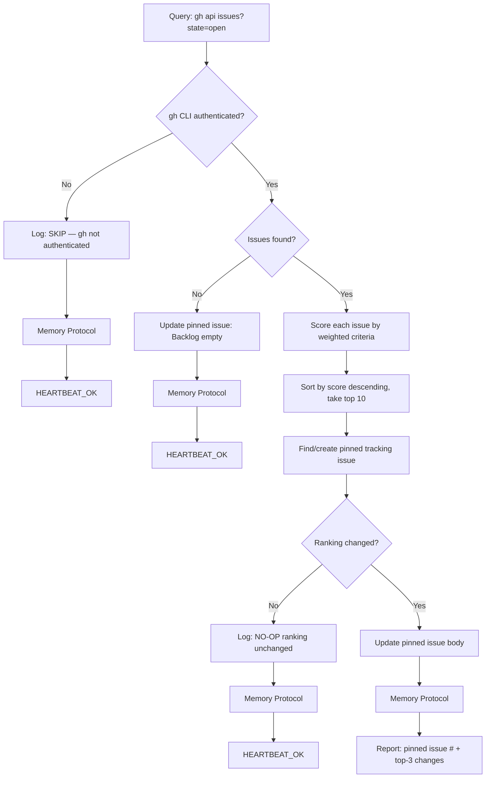

# Backlog Ranking

Curate and rank all open GitHub issues by weighted PM criteria, maintaining a
pinned "Feature Backlog — Top 10" tracking issue that gives stakeholders a
daily prioritized snapshot.

## Decision Flow



## Instructions

### 1. Guard: gh CLI authentication

```bash
gh auth status 2>&1
```

If this fails (non-zero exit), log `[backlog-rank] SKIP: gh CLI not authenticated` → Memory Protocol → `HEARTBEAT_OK`. Stop here.

### 2. One-time setup: ensure `backlog` label exists

```bash
gh label create backlog --repo ryaneggz/next-postgres-shadcn \
  --description "Curated feature backlog" --color "1d76db" 2>/dev/null || true
```

### 3. Find or create the pinned tracking issue

Search for an existing open issue with the `backlog` label:

```bash
gh api "repos/ryaneggz/next-postgres-shadcn/issues?state=open&labels=backlog&per_page=10" \
  --jq '[.[] | select(.title == "Feature Backlog — Top 10")] | first'
```

If none exists, create one:

```bash
gh issue create --repo ryaneggz/next-postgres-shadcn \
  --title "Feature Backlog — Top 10" \
  --label backlog \
  --body "# Feature Backlog — Top 10\n\n> Initializing — first ranking pending.\n"
```

Then pin it:

```bash
gh issue pin <NUMBER> --repo ryaneggz/next-postgres-shadcn
```

Save the tracking issue number for later.

### 4. Query all open issues (excluding the tracking issue)

```bash
gh api "repos/ryaneggz/next-postgres-shadcn/issues?state=open&per_page=100" \
  --jq '[.[] | select(.pull_request == null)]'
```

Filter out the tracking issue itself (by number) from the results.

If zero issues remain after filtering, update the tracking issue body to:

```markdown
# Feature Backlog — Top 10
> Last updated: YYYY-MM-DD HH:MM UTC

No open issues to rank. Backlog empty.
```

Then log `[backlog-rank] OP: Backlog empty, tracking issue updated` → Memory Protocol → `HEARTBEAT_OK`.

### 5. Score each issue

Apply the following weighted criteria to produce a score from 0–100:

| Criterion | Weight | Max Points | Signal |
|-----------|--------|------------|--------|
| Strategic value | 25% | 25 | Labels (`enhancement` = 25, `skill` = 20, `bug` = 15, `task` = 10, unlabeled = 5), plus title/body keyword analysis |
| Community signal | 20% | 20 | `min(20, (reactions.total_count * 4) + (comments * 2))` |
| Feasibility | 20% | 20 | Has body > 100 chars = 10, has acceptance criteria / checklist = 10 |
| Dependencies | 15% | 15 | No cross-references = 15, has "blocked" mention = 5, is blocking others = 15 |
| Age | 10% | 10 | `min(10, days_since_created / 7)` — older issues get modest boost |
| Staleness | 10% | 10 | `max(0, 10 - days_since_last_update / 3)` — recently active score higher |

**Scoring rules:**
- Parse `reactions.total_count` and `comments` from the API response
- For feasibility, check if `body` contains checkbox patterns (`- [ ]`, `- [x]`) or keywords like "acceptance criteria", "requirements", "expected behavior"
- For dependencies, search body for `#<number>` cross-references and keywords "blocked", "blocking", "depends on"
- For age/staleness, use `created_at` and `updated_at` timestamps

### 6. Rank and format

Sort issues by score descending. Take the top 10.

If fewer than 10 issues have the `enhancement` label, fill remaining slots with top issues of other types. Mark non-enhancement issues with their actual label in the table.

Format the new ranking as:

```markdown
# Feature Backlog — Top 10
> Last updated: YYYY-MM-DD HH:MM UTC

| Rank | Issue | Score | Strategic | Community | Feasibility | Deps | Age | Fresh |
|------|-------|-------|-----------|-----------|-------------|------|-----|-------|
| 1 | #N: Title | 85 | 25 | 18 | 20 | 15 | 4 | 3 |
| ... | ... | ... | ... | ... | ... | ... | ... | ... |

## Changes Since Last Ranking
- [position changes, new entries, dropped entries — or "First ranking" if no prior data]

## Gaps Observed
- [up to 3 pattern observations, e.g. "multiple auth issues but no session mgmt proposal"]
- [areas with no coverage, clustering of similar issues, etc.]
```

### 7. Compare with current ranking

Read the current body of the tracking issue. Parse the existing table to extract the previous ranking (issue numbers in order).

Compare the new ranking with the old:
- Same issues in the same order → ranking unchanged
- Any difference in issues or order → ranking changed

If **unchanged**, log `[backlog-rank] NO-OP: Ranking unchanged (top: #N1, #N2, #N3)` → Memory Protocol → `HEARTBEAT_OK`.

### 8. Update the tracking issue

If ranking **changed**, update the pinned issue body:

```bash
gh issue edit <TRACKING_NUMBER> --repo ryaneggz/next-postgres-shadcn \
  --body "<new formatted body>"
```

Log `[backlog-rank] OP: Ranking updated — pinned issue #<TRACKING_NUMBER>`.

### 9. Memory Improvement Protocol

This runs at the end of **EVERY** execution — op, no-op, or skip.

**a) Log** — append to `memory/YYYY-MM-DD.md`:

```markdown
## Backlog Ranking — HH:MM UTC
- **Result**: OP | NO-OP | SKIP
- **Item**: Pinned issue #<TRACKING_NUMBER> (or "none")
- **Action**: [ranking updated / unchanged / backlog empty / skipped (auth)]
- **Duration**: ~Xs
- **Observation**: [one sentence — what changed, patterns noticed, or confirmed stable]
```

**b) Qualify** — ask yourself:
- Did any issue make a large jump (3+ positions)? → Note what changed
- Are there clusters of similar issues? → Note in Gaps Observed
- Did scoring reveal a gap in the criteria? → Note suggestion
- Is the ranking stable across multiple days? → Note maturity signal

**c) Improve** — if qualification found something actionable:
- Append to `MEMORY.md > Lessons Learned` for durable insights
- Do NOT update MEMORY.md for routine unchanged rankings

**d) Report** — end with:
- `HEARTBEAT_OK` (unchanged or empty)
- `HEARTBEAT_OK — memory updated` (learned something)
- Full report (ranking changed — pinned issue # + top-3 position changes)

## Reference

### Key Resources

| Resource | Path |
|----------|------|
| Tracking issue label | `backlog` |
| Identity | `IDENTITY.md` |
| Memory | `MEMORY.md` |
| Daily Logs | `memory/YYYY-MM-DD.md` |
