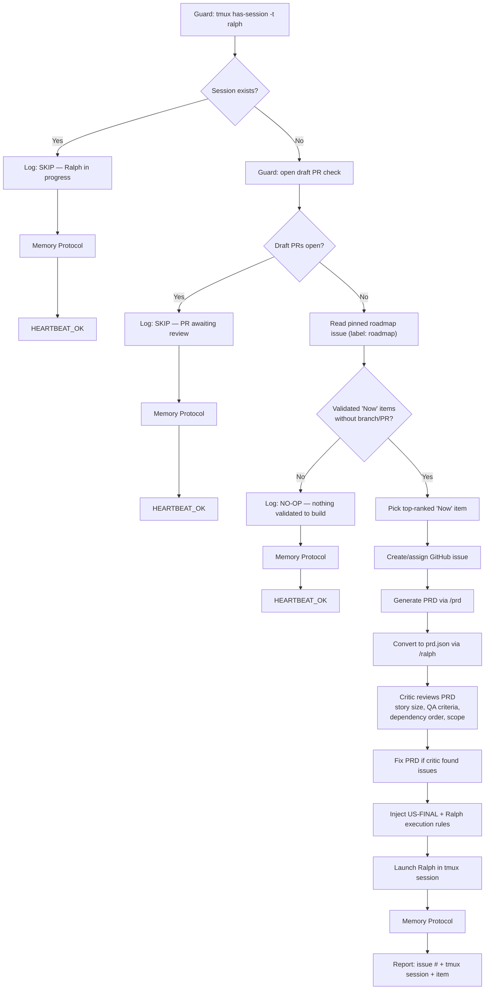

# Implement

Pick the highest-priority validated roadmap item and execute a full Ralph implementation loop in a tmux session. The loop runs 1:1 iteration-to-story, uses agent-browser for UI QA, and culminates in a draft PR with CI green.

## Decision Flow



## Instructions

### 1. Guard: tmux session check

```bash
tmux has-session -t ralph 2>/dev/null
```

If exit code is 0 (session exists), log `[implement] SKIP: Ralph session already running` → Memory Protocol → `HEARTBEAT_OK`. Stop.

### 2. Guard: open draft PR check

```bash
gh pr list --repo ryaneggz/next-postgres-shadcn --author @me --state open --draft --json number --jq 'length'
```

If result > 0, log `[implement] SKIP: Draft PR awaiting review` → Memory Protocol → `HEARTBEAT_OK`. Stop.

### 3. Pick highest priority validated item

Read the pinned roadmap issue:
```bash
gh api "repos/ryaneggz/next-postgres-shadcn/issues?state=open&labels=roadmap&per_page=5" \
  --jq '[.[] | select(.title == "Product Roadmap")] | first | .body'
```

Parse the "Building Now" table from the issue body. Extract items in rank order.

For each item, check if a branch or PR already exists:
```bash
gh pr list --repo ryaneggz/next-postgres-shadcn --search "<item title>" --json number --jq 'length'
```

**Only consider items in phase "Now"** — these have validated signal or are infrastructure prereqs. Skip items with signal "none".

If nothing validated to pick, log `[implement] NO-OP: No validated items ready to build` → Memory Protocol → `HEARTBEAT_OK`. Stop.

### 4. Create GitHub issue if not exists

If the roadmap item doesn't have a linked issue number:
```bash
gh issue create --repo ryaneggz/next-postgres-shadcn \
  --title "<item title>" \
  --body "<item description>\n\nFrom roadmap rank #<N>. Signal: <signal evidence>." \
  --label enhancement
```

Assign to self:
```bash
gh issue edit <N> --repo ryaneggz/next-postgres-shadcn --add-assignee @me
```

### 5. Generate Ralph PRD

Run the `/prd` skill with the roadmap item details to produce a PRD markdown file.

Then run the `/ralph` skill to convert it to `.ralph/prd.json`.

### 6. Inject Ralph execution rules

Before launching Ralph, ensure `.ralph/CLAUDE.md` contains these rules (append if not present):

```markdown
## Execution Rules (Injected by /implement skill)

### 1:1 Iteration-to-Story
Each Ralph iteration works on exactly ONE user story. Never combine stories. Never skip ahead. One iteration = one story = one commit.

### Browser QA for UI Stories
After implementing any story that touches frontend (components, pages, styles, layouts):
1. Use the `agent-browser` skill to navigate to the affected page
2. Interact with the UI elements you changed
3. Take a screenshot for the progress log
4. Verify the change works visually
5. If browser QA fails, fix the issue in the SAME iteration before marking `passes: true`
6. Do NOT leave broken UI for the next iteration — reconcile immediately

### Backend Integration Verification
After implementing API routes, server actions, or database changes:
1. Verify the endpoint works (curl, fetch, or via UI if a page exists)
2. Check that data persists correctly
3. Verify error handling with invalid input

### Quality Gate Per Story
Before marking ANY story as `passes: true`:
1. Run `npm run type-check` — must pass
2. Run `npm run lint` — must pass
3. Run `npm test` — must pass
4. If any check fails, fix in the SAME iteration
```

### 7. Critic review of PRD

Before committing to a Ralph loop (which consumes significant resources), spawn the Critic (`.claude/agents/critic.md`) to review the generated PRD:

Pass the critic:
- The full `.ralph/prd.json` content
- The roadmap item title and description
- The issue body for context
- Instruction to evaluate:
  - Are any stories too large for a single Ralph iteration? (must be completable in one context window)
  - Are UI stories missing "Verify in browser using agent-browser skill"?
  - Are stories missing "Typecheck passes"?
  - Is the dependency ordering correct? (schema → backend → frontend → integration)
  - Are acceptance criteria verifiable (not vague)?
  - Is the scope realistic for 10-15 iterations?
  - Does US-FINAL include `Closes #<N>` in its PR body criteria?
  - Does US-FINAL include a Roadmap Context section matching the pinned roadmap properties?

**If the Critic identifies issues**, fix the PRD before proceeding:
- Split stories that are too large
- Add missing acceptance criteria
- Reorder dependencies
- Remove scope that doesn't belong

**If the Critic approves**, proceed to step 8.

This is not optional — the Critic must sign off before Ralph runs. Catching a bad PRD here saves 15 wasted Ralph iterations.

### 8. Inject US-FINAL into prd.json

Read the current `.ralph/prd.json`, find the highest priority number, then append:

```json
{
  "id": "US-FINAL",
  "title": "Archive Ralph run, validate app, submit draft PR, and verify CI green",
  "description": "As the agent, I archive the Ralph run, validate the app is serving, submit all work as a draft PR with review docs, and confirm CI passes.",
  "acceptanceCriteria": [
    "All previous stories have passes: true",
    "Archive .ralph/prd.json and .ralph/progress.txt to .ralph/archives/YYYY-MM-DD/<feature>/ (plural archives, date and feature as SEPARATE directories)",
    "Verify archive exists: ls .ralph/archives/YYYY-MM-DD/<feature>/prd.json must succeed",
    "Verify dev server: curl -s -o /dev/null -w '%{http_code}' http://localhost:3000/ must return 200 — if not running, start with npm run dev and wait",
    "Verify public URL: curl -s -o /dev/null -w '%{http_code}' https://next-postgres-shadcn.ruska.dev/ must return 200 — if 502/000, this is a BLOCKER",
    "Create feature branch: git checkout -b feat/<N>-<shortdesc> from agent/next-postgres-shadcn (NEVER git clone)",
    "Push all commits to the feature branch",
    "Create draft PR to development with body containing: Closes #<N> (MUST be on its own line so GitHub auto-closes the issue on merge), ## Roadmap Context (rank, category, phase, complexity, signal — copied from the roadmap to maintain traceability), ## What (summary of all changes made across stories), ## Why (motivation — link to roadmap item and GitHub issue, explain the user signal that justified building this), ## How (implementation approach, key architecture decisions, tradeoffs), ## Manual Review Steps (numbered checklist: specific pages to visit, interactions to test, edge cases to verify — written for a human reviewer who has NOT seen the code), ## Acceptance Criteria (consolidated from all user stories)",
    "PR body MUST include 'Closes #<N>' where N is the GitHub issue number — this auto-closes the issue when the PR merges",
    "PR body MUST include a Roadmap Context section with: Rank, Category, Phase, Complexity, Signal — matching the pinned roadmap issue exactly",
    "PR title follows format: feat(#<N>): <description>",
    "Run /ci-status after push — poll until CI completes",
    "If CI fails: read failure logs, fix the issue, push again, re-poll until GREEN",
    "This story is NOT complete until CI pipeline is GREEN AND public URL returns 200 — do not mark passes: true otherwise"
  ],
  "priority": 999,
  "passes": false,
  "notes": "ALWAYS the last story. Archive to .ralph/archives/YYYY-MM-DD/<feature>/. Dev server + public URL MUST be verified. CI MUST be green. PR body MUST have Closes #N and Roadmap Context."
}
```

Set its priority to `max(existing priorities) + 100` to ensure it's always last.

### 9. Launch Ralph in tmux

Run this from within the container (via `docker exec`), using `gosu sandbox` to drop from root to the sandbox user — Claude Code refuses `--dangerously-skip-permissions` when running as root:

```bash
tmux new-session -d -s ralph -c /home/sandbox/harness/workspace \
  "gosu sandbox bash -c 'cd .ralph && HOME=/home/sandbox ./ralph.sh --tool claude 15 2>&1 | tee ralph-\$(date +%Y%m%d-%H%M).log'"
```

Log `[implement] OP: Launched Ralph in tmux for issue #<N> "<title>"`.

### 10. Memory Improvement Protocol

**a) Log** — append to `memory/YYYY-MM-DD.md`:

```markdown
## Implement — HH:MM UTC
- **Result**: OP | NO-OP | SKIP
- **Item**: #<N> "<title>" (or "none")
- **Action**: [Ralph launched in tmux / skipped (guard) / no validated items]
- **Duration**: ~Xs
- **Observation**: [one sentence]
```

**b) Qualify**:
- Did the roadmap have items but none validated? → Note signal gap
- Did guard catch an existing session? → Note idempotency confirmed
- Is the same item being picked repeatedly? → Note potential blocker

**c) Improve** — if actionable, append to `MEMORY.md > Lessons Learned`

**d) Report**:
- `HEARTBEAT_OK` (skip/no-op)
- `HEARTBEAT_OK — Ralph launched for #<N>` (op)

## Reference

### Key Resources

| Resource | Path |
|----------|------|
| Roadmap issue label | `roadmap` |
| Critic | `.claude/agents/critic.md` |
| Ralph script | `.ralph/ralph.sh` |
| Ralph instructions | `.ralph/CLAUDE.md` |
| Ralph PRD | `.ralph/prd.json` |
| Ralph archives | `.ralph/archives/` |
| PRD skill | `.claude/skills/prd/SKILL.md` |
| Ralph converter | `.claude/skills/ralph/SKILL.md` |
| CI status | `.claude/skills/ci-status/SKILL.md` |
| Identity | `IDENTITY.md` |
| Memory | `MEMORY.md` |
| Daily Logs | `memory/YYYY-MM-DD.md` |
