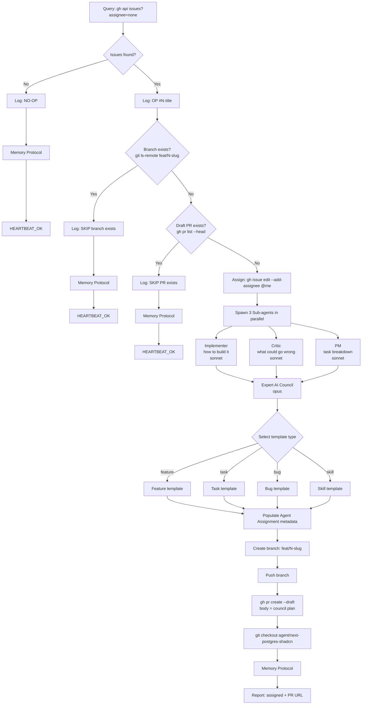
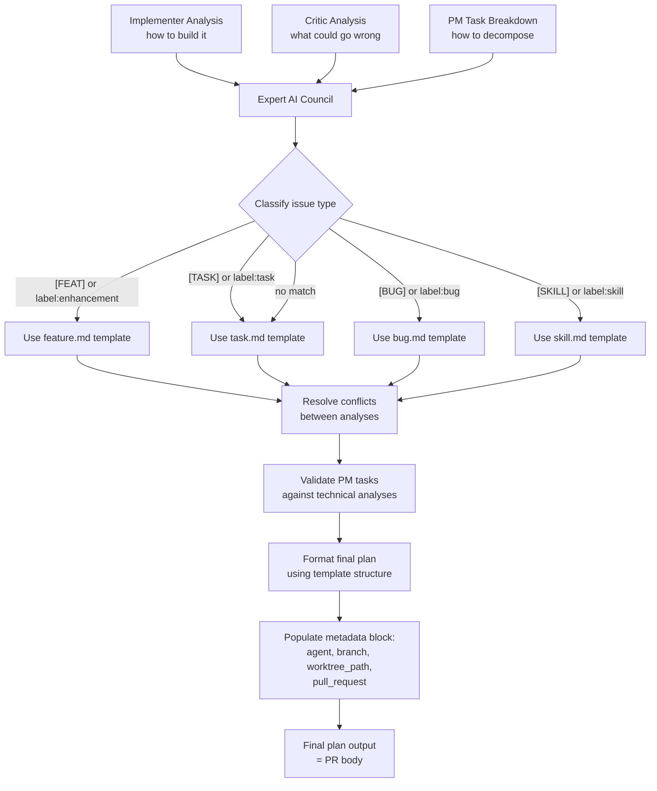
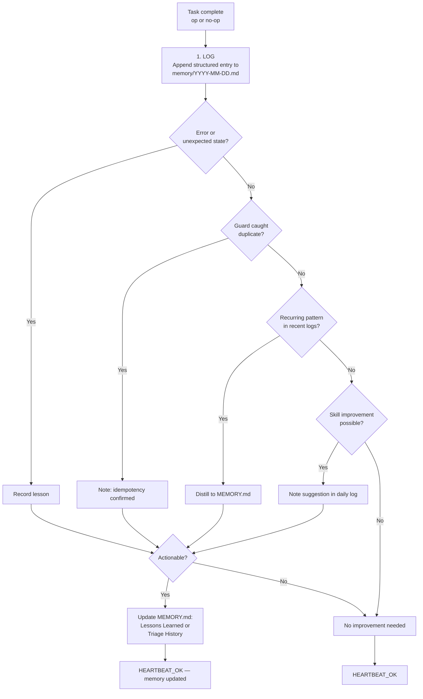

# Issue Triage

Autonomously triage open, unassigned GitHub issues by spawning parallel expert sub-agents,
synthesizing their analyses via an Expert AI Council, and opening a draft PR with the
implementation plan.

## Decision Flow



## Instructions

### 1. Query for unassigned issues

```bash
gh api "repos/ryaneggz/next-postgres-shadcn/issues?state=open&assignee=none&sort=created&direction=asc&per_page=1"
```

This returns the oldest open unassigned issue as a JSON array. Parse the first element for `number`, `title`, `body`, `url`, and `labels`.

### 2. Log op/no-op — BEFORE any mutation

If the array is empty:
```
echo "[issue-triage] NO-OP: No unassigned issues found"
```
Then run the **Memory Improvement Protocol** (step 11) and reply `HEARTBEAT_OK`. Stop here.

If an issue is found:
```
echo "[issue-triage] OP: Found issue #<N> \"<title>\""
```
Continue to step 3.

### 3. Guard: existing branch

```bash
git ls-remote --heads origin "feat/<N>-<shortdesc>"
```

Where `<shortdesc>` is derived from the title: lowercase, spaces to hyphens, strip non-alphanumeric, truncate to 40 chars.

If output is non-empty, log `[issue-triage] SKIP: Branch feat/<N>-<shortdesc> already exists` → Memory Protocol → `HEARTBEAT_OK`.

### 4. Guard: existing PR

```bash
gh pr list --repo ryaneggz/next-postgres-shadcn --head "feat/<N>-<shortdesc>" --state open --json number --jq 'length'
```

If result > 0, log `[issue-triage] SKIP: Draft PR already exists` → Memory Protocol → `HEARTBEAT_OK`.

### 5. Assign the issue

```bash
gh issue edit <N> --repo ryaneggz/next-postgres-shadcn --add-assignee @me
```

### 6. Spawn parallel sub-agents

Launch 3 Agent tool calls **in a single message** (parallel execution). Each sub-agent is defined in `.claude/agents/`:

| Sub-agent | Agent file | Perspective | Model |
|-----------|-----------|-------------|-------|
| **Implementer** | `.claude/agents/implementer.md` | "Here's how I'd build this" — practical approach, affected files, architecture | sonnet |
| **Critic** | `.claude/agents/critic.md` | "Here's what could go wrong" — edge cases, security, performance, failure modes | sonnet |
| **PM** | `.claude/agents/pm.md` | "Here's how to break it down" — tasks, contracts, model delegation, ordering | sonnet |

Pass each sub-agent:
- Issue number, title, body, URL, and labels
- Instruction to read `IDENTITY.md` and `MEMORY.md` for stack context
- Instruction to follow their agent definition's output format exactly

The three perspectives are **adversarial/complementary**: Implementer proposes, Critic challenges, PM structures. Sub-agents do NOT see each other's output.

### 7. Expert AI Council

Launch a single Agent tool call using the council agent (`.claude/agents/council.md`):



Pass the Council:
- All three sub-agent analyses
- Issue number, title, shortdesc (for metadata block)
- Instruction to read `.github/ISSUE_TEMPLATE/` for the matching template structure
- The Agent Assignment metadata values to populate:
  ```yml
  agent: "next-postgres-shadcn"
  branch: "feat/<N>-<shortdesc>"
  worktree_path: ".worktrees/agent/next-postgres-shadcn"
  pull_request: "FROM feat/<N>-<shortdesc> TO development"
  ```

The Council's output becomes the PR body directly.

### 8. Create feature branch

```bash
SHORTDESC=$(echo "<title>" | tr '[:upper:]' '[:lower:]' | sed 's/[^a-z0-9 ]//g' | tr ' ' '-' | cut -c1-40 | sed 's/-$//')
BRANCH="feat/<N>-${SHORTDESC}"

git fetch origin agent/next-postgres-shadcn
git checkout -b "$BRANCH" origin/agent/next-postgres-shadcn
git push -u origin "$BRANCH"
```

### 9. Open draft PR

```bash
gh pr create \
  --repo ryaneggz/next-postgres-shadcn \
  --base development \
  --head "$BRANCH" \
  --title "<type>(#<N>): <title>" \
  --draft \
  --body "<council output>"
```

The `<type>` is determined by the Council's classification:
- `[FEAT]` → `feat`
- `[TASK]` → `task`
- `[BUG]` → `fix`
- `[SKILL]` → `skill`

The PR body IS the plan. No files are committed to the branch — it exists only to host the draft PR. Implementation commits come later when the plan is approved.

### 10. Cleanup

```bash
git checkout agent/next-postgres-shadcn
```

### 11. Memory Improvement Protocol

This runs at the end of **EVERY** execution — op, no-op, or guard skip.



**a) Log** — append to `memory/YYYY-MM-DD.md`:

```markdown
## Issue Triage — HH:MM UTC
- **Result**: OP | NO-OP | SKIP
- **Issue**: #<N> "<title>" (or "none")
- **Action taken**: assigned + draft PR / skipped (guard) / no issues
- **Duration**: ~Xs
- **Observation**: <one sentence — what was notable, unexpected, or confirmed>
```

**b) Qualify** — ask yourself:
- Did I encounter an error or unexpected state? → Log as lesson
- Did a guard catch a duplicate? → Note idempotency confirmed
- Did the planner council produce a good plan? → Note what worked/didn't
- Is there a recurring pattern across recent daily logs? → Distill into MEMORY.md
- Can this skill be improved based on this run? → Note suggestion

**c) Improve** — if qualification found something actionable:
- Append to `MEMORY.md > Lessons Learned` for durable insights
- Append to `MEMORY.md > Triage History` for patterns
- Do NOT update MEMORY.md for routine no-ops — only when there's signal

**d) Report** — end with:
- `HEARTBEAT_OK` (routine no-op)
- `HEARTBEAT_OK — memory updated` (learned something)
- Full report (op — what was done + what was learned)

## Reference

### Issue Template Mapping

| Title Prefix | Label | Template | Commit Type |
|-------------|-------|----------|-------------|
| `[FEAT]` | enhancement | feature.md | feat |
| `[TASK]` | task | task.md | task |
| `[BUG]` | bug | bug.md | fix |
| `[SKILL]` | skill | skill.md | skill |
| no match | — | task.md | task |

### Key Resources

| Resource | Path |
|----------|------|
| Agent: Implementer | `.claude/agents/implementer.md` |
| Agent: Critic | `.claude/agents/critic.md` |
| Agent: PM | `.claude/agents/pm.md` |
| Agent: Council | `.claude/agents/council.md` |
| Rule: Issue Triage | `.claude/rules/issue-triage.md` |
| Issue Templates | `.github/ISSUE_TEMPLATE/` |
| Identity | `IDENTITY.md` |
| Memory | `MEMORY.md` |
| Daily Logs | `memory/YYYY-MM-DD.md` |
